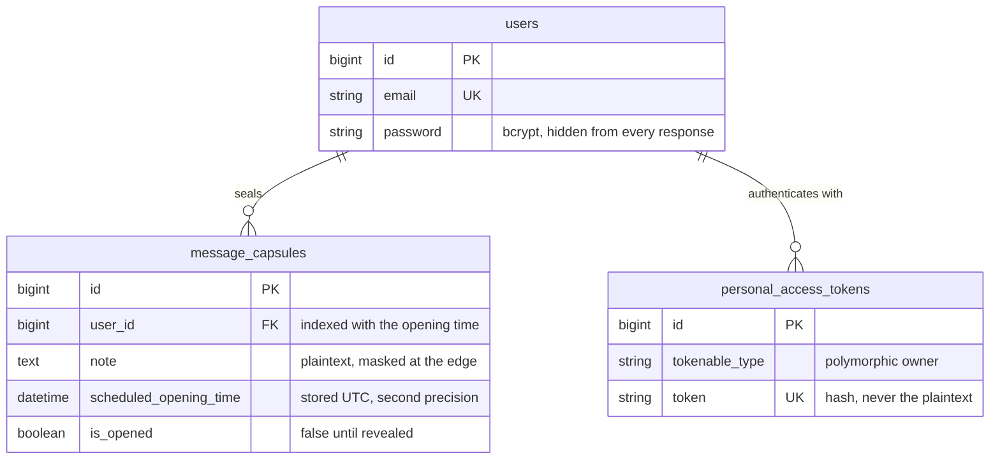
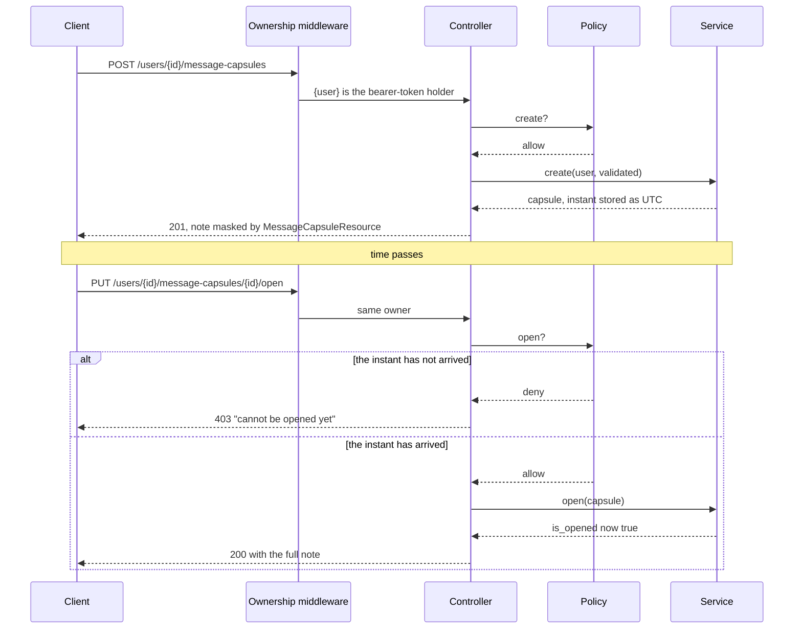

# Time Capsule API

A Laravel HTTP API for notes that cannot be read yet. You write a note, pick an
instant in the future, and the API seals it: until that instant passes it hands
back only a four-character teaser (`Tomo****`), and the capsule refuses to open.
There is no interface here — the companion Vue client is `dealers-united-vue-app`.

## The one rule everything else serves

A capsule is sealed until `scheduled_opening_time`, and *the server* decides that.

- Masking happens in `MessageCapsuleResource`, so every endpoint that returns a
  capsule masks it — including `POST`, where a leak would be easiest to miss.
- The boundary is inclusive: a capsule scheduled for exactly *now* is openable.
- Masking keys off `is_opened`, not the clock, so a capsule that has unlocked but
  which nobody opened is still masked in the listing.
- Being early is a `403`, not a `401` — the caller is authenticated, just early.
- The teaser counts characters rather than bytes, and a note no longer than the
  preview is masked entirely rather than revealed whole.

Named tests pin all five, among them `the_unlock_boundary_is_inclusive`,
`an_unlocked_but_unopened_note_is_still_masked_in_the_listing`,
`reading_a_still_sealed_capsule_is_forbidden_not_unauthenticated` and
`it_counts_characters_not_bytes`.

## What it answers

Captured with `curl` against a locally served instance. `POST` a note and an
instant, and the capsule comes back already sealed:

```http
HTTP/1.1 201 Created

{
  "data": {
    "id": 5,
    "note": "Tomo****",
    "scheduled_opening_time": "2026-10-25T04:32:58.000000Z",
    "is_opened": false,
    "can_be_opened": false
  }
}
```

Reaching for it early is refused with
`403 {"message": "Message capsule cannot be opened yet - time remaining."}`; once
the instant has passed the same `PUT .../5/open` answers `200` with `note` in full
and `is_opened` flipped to `true`. The full session — validation rejections, opt-in
pagination, cross-account and anonymous cases, the reveal — is in
[`docs/api-walkthrough.md`](docs/api-walkthrough.md).

## Endpoints

Everything sits under `/api/v1`. Auth is a Sanctum bearer token issued by register
and login — Fortify handles the credentials, `FortifyServiceProvider` swaps its
redirect responses for JSON.

| Method | Path | Purpose |
| --- | --- | --- |
| `POST` | `/register` | Create an account, returns `{ user, token }` |
| `POST` | `/login` | Exchange credentials for `{ user, token }` |
| `POST` | `/logout` | Revoke the session, `204 No Content` |
| `GET` | `/user` | The signed-in account |
| `GET` | `/users/{user}/message-capsules` | The user's capsules, sealed ones masked |
| `POST` | `/users/{user}/message-capsules` | Seal a new capsule |
| `GET` | `/users/{user}/message-capsules/{capsule}` | One capsule, once its instant has passed |
| `PUT` | `/users/{user}/message-capsules/{capsule}/open` | Reveal a capsule, idempotent |

Capsule routes are nested under `/users/{user}` and carry
`EnsureRequestUserAuthenticated`, which refuses any attempt to address another
account's collection before the controller or the policy is reached. Errors are
always `{"message": "..."}`, with `errors` added on validation failures — `401`
means the token is missing or invalid, `403` means authenticated but not allowed,
which includes "too early". The listing returns the whole collection by default;
`?per_page=` (or `?page=`) opts into a paginated response with `links` and `meta`
capped by `CAPSULE_MAX_PER_PAGE`, opt-in so the existing client, which fetches
everything and pages in the browser, keeps working.

## The data it keeps



Three columns carry the domain. `note` is plain text — the mask is presentation,
not encryption. `scheduled_opening_time` is a `dateTime` at zero fractional
precision, written as UTC by the `UtcDateTime` cast. `is_opened` is a capsule's
only mutable field and only ever goes false to true. The listing filters on
`user_id` and orders by `scheduled_opening_time`, so a composite index covers that
pair (`message_capsules_user_schedule_index`) — a range read already in the right
order rather than a scan plus filesort. That is an argument about the query plan,
not a measurement: there is no benchmark here and the seeded dataset is far too
small to produce a useful one.

## Sealing, then opening



The controller does four things and no more: authorise, validate, call
`MessageCapsuleService`, return a resource. The service never sees a request, so an
Artisan command or a queued job can seal and open capsules the same way.
`MessageCapsulePolicy` owns both halves of "may you touch this" — ownership, and
whether the instant has passed — comparing foreign keys rather than loading the
owner, so authorisation costs no extra query.

## Run it

PHP 8.1+ and Composer, no database server:

```bash
composer install          # also writes .env from .env.example and sets APP_KEY
touch database/database.sqlite
sed -i '' 's#^DB_CONNECTION=.*#DB_CONNECTION=sqlite#' .env      # GNU sed: drop the ''
sed -i '' "s#^DB_DATABASE=.*#DB_DATABASE=$(pwd)/database/database.sqlite#" .env
php artisan migrate --seed
php artisan serve --port=8620

curl -s http://127.0.0.1:8620/      # {"service":"...","status":"ok","api":"/api/v1"}
curl -s -X POST http://127.0.0.1:8620/api/v1/login \
  -H 'Accept: application/json' -H 'Content-Type: application/json' \
  -d '{"email":"demo@example.com","password":"correct-horse-battery-staple"}'
```

The seeder creates that demo account with four capsules (one already read, one
unlocked and waiting, two sealed) and login answers `{ user, token }`.

`docker compose up -d --build` brings up app, nginx, MySQL, Redis and Mailpit on
host ports 8620–8626, then `key:generate` and `migrate --seed` inside `app`. That
compose file parses cleanly under `docker compose config`, but the images have not
been built or booted here — the nginx↔php-fpm wiring is unexercised.

```bash
composer test          # PHPUnit against in-memory SQLite, nothing external needed
composer lint:check    # Pint in check mode, for CI (composer lint fixes in place)
php artisan route:list --except-vendor
```

`phpunit.xml` pins `DB_CONNECTION=sqlite`, `DB_DATABASE=:memory:` and
`APP_TIMEZONE=UTC`, so the 44 tests need no infrastructure. Suite, lint and route
output are captured in [`docs/test-run.md`](docs/test-run.md).

## Timestamps are instants, not wall-clock readings

`APP_TIMEZONE` defaults to `UTC`, and `scheduled_opening_time` is cast through
`App\Casts\UtcDateTime` rather than Eloquent's built-in `datetime`. The built-in
tries `Carbon::createFromFormat('Y-m-d H:i:s', …)` first, and PHP treats the
trailing `+01:00` of an ISO-8601 string as *trailing data* — a warning, not an
error — so the offset is dropped, the wall clock kept, and a Berlin client's
capsule unlocks an hour late. `Carbon::parse` honours the offset, so the cast uses
it, stores UTC and reads back as UTC explicitly. Tested by
`an_offset_timestamp_is_normalised_to_utc` and
`an_offset_carrying_timestamp_is_understood_as_an_absolute_instant`.

Send an explicit offset (`2026-10-25T04:26:15Z` or `+01:00`); a value without one
is read as `APP_TIMEZONE`. Responses always carry UTC (`…Z`).

## Configuration

[`.env.example`](.env.example) is the full commented list, and `APP_KEY` — the one
variable with no usable default — is generated by `composer install`. The knobs
that belong to this application rather than to Laravel:

| Variable | Default | Purpose |
| --- | --- | --- |
| `APP_TIMEZONE` | `UTC` | Changing it changes the instant every capsule unlocks |
| `CAPSULE_PREVIEW_LENGTH` | `4` | Characters kept before the asterisks — `0` masks everything |
| `CAPSULE_MAX_NOTE_LENGTH` | `5000` | Bound on a stored note. The column is `TEXT`, so without it one request can push 64 KB |
| `CAPSULE_DEFAULT_PER_PAGE` | `15` | Page size when `?page=` is given without `?per_page=` |
| `CAPSULE_MAX_PER_PAGE` | `100` | Largest page a caller may request |
| `CORS_ALLOWED_ORIGINS` | `*` | Comma-separated client origins. Set a real list outside development |

`config/capsules.php` reads those and binds `NoteMasker`, so "mask everything",
"show a word count" or "show the first line" is a new class plus a config line.

## Notes for the Vue client

Two things to know if you read `dealers-united-vue-app` alongside this. `POST`
returns a `MessageCapsuleResource`, so the created capsule arrives wrapped in
`data` and already masked — that client's `listCapsules` and `openCapsule` unwrap
`data`, its `createCapsule` does not, and its store re-masks the note locally,
which this shape makes redundant. And its `src/lib/datetime.js` expects a naive
timestamp and assumes UTC, where this API sends ISO-8601 with an explicit `Z`;
that parser handles both forms, so the two agree on the instant, but the comment
describes an older shape.

## What this does not do

- **No edit, no delete, no audit.** Seal, list, open is the whole model, and
  nothing records *when* a capsule was opened, only that it was.
- **Notes are plaintext in the database.** Anyone with database access reads every
  sealed note; real secrecy needs a key released at the opening time, a far larger
  project.
- **A short note reveals more of itself proportionally** — a five-character note
  shows four of its five, unless you set `CAPSULE_PREVIEW_LENGTH=0`.
- **Nothing announces an unlock.** The client polls. Redis and Mailpit are in the
  compose stack, but the application queues nothing.
- **Password reset is routed but undelivered.** Fortify's reset endpoints mail
  through whatever `MAIL_MAILER` is set to — Mailpit in development, nothing else.
