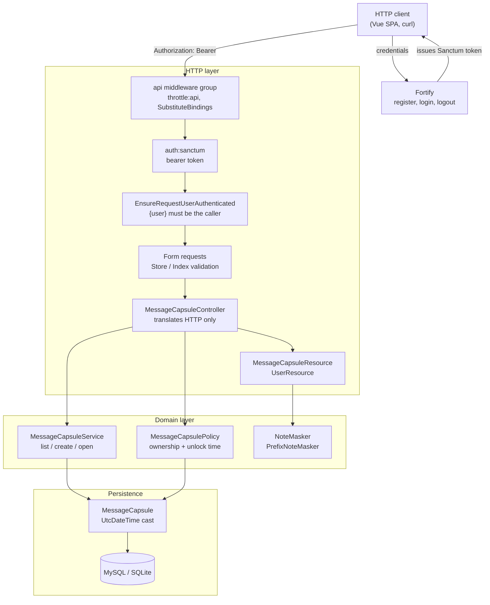
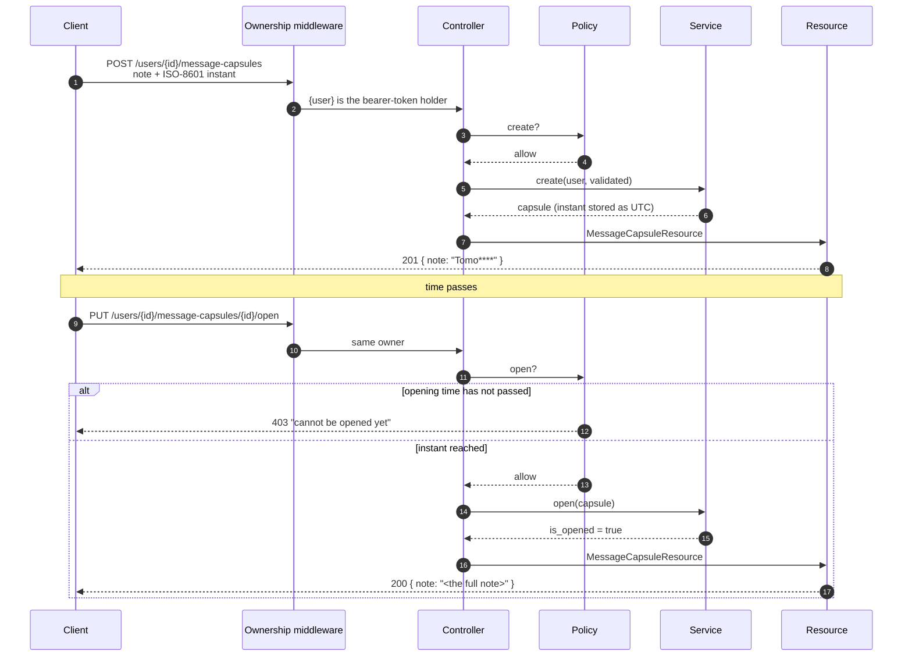

# Time Capsule API

A small Laravel API for digital time capsules. A signed-in user writes a note,
picks an instant in the future, and the note is sealed: until that instant
passes the API will only return a four-character teaser (`Tomo****`), and the
capsule can only be opened afterwards. Masking and the unlock rule are enforced
on the server, not in the client.

It is an HTTP API with no interface of its own. The companion Vue client lives
in [`dealers-united-vue-app`](../dealers-united-vue-app).

## Captured output

Every request and response below was produced by `curl` against the API running
locally; the full session is in [`docs/api-walkthrough.md`](docs/api-walkthrough.md)
and the test, lint and route output is in [`docs/test-run.md`](docs/test-run.md).

Sealing a capsule — the response is already masked:

```http
POST /api/v1/users/2/message-capsules

{
  "note": "Tomorrow you will be proud of how patient you were.",
  "scheduled_opening_time": "2026-10-25T04:32:58Z"
}
```

```http
HTTP/1.1 201 Created

{
  "data": {
    "id": 5,
    "note": "Tomo****",
    "scheduled_opening_time": "2026-10-25T04:32:58.000000Z",
    "is_opened": false,
    "can_be_opened": false
  }
}
```

Trying to open it early:

```http
PUT /api/v1/users/2/message-capsules/5/open
```

```http
HTTP/1.1 403 Forbidden

{
  "message": "Message capsule cannot be opened yet - time remaining."
}
```

Opening one whose instant has passed returns the note in full:

```http
HTTP/1.1 200 OK

{
  "data": {
    "id": 2,
    "note": "Remember to call your sister on her birthday.",
    "scheduled_opening_time": "2026-09-25T02:32:53.000000Z",
    "is_opened": true,
    "can_be_opened": false
  }
}
```

## Architecture



Dependencies point inward. The controller knows about HTTP and calls the
service; the service knows about capsules and calls the model; neither the
service nor the policy can see a request or a response.

## Sealing and opening a capsule



## Quickstart

The shortest path needs PHP 8.1+ and Composer, and no database server:

```bash
composer install          # also writes .env from .env.example and sets APP_KEY

touch database/database.sqlite
sed -i '' 's#^DB_CONNECTION=.*#DB_CONNECTION=sqlite#' .env
sed -i '' "s#^DB_DATABASE=.*#DB_DATABASE=$(pwd)/database/database.sqlite#" .env

php artisan migrate --seed
php artisan serve --port=8620
```

(On GNU sed, drop the `''` after `-i`.)

```bash
curl -s http://127.0.0.1:8620/
# {"service":"Time Capsule API","status":"ok","api":"/api/v1"}

curl -s -X POST http://127.0.0.1:8620/api/v1/login \
  -H 'Accept: application/json' -H 'Content-Type: application/json' \
  -d '{"email":"demo@example.com","password":"correct-horse-battery-staple"}'
# {"user":{"id":1,...},"token":"1|..."}
```

The seeder creates `demo@example.com` / `correct-horse-battery-staple` with
four capsules: one already read, one unlocked and waiting, two still sealed.

With Docker instead:

```bash
cp .env.example .env
docker compose up -d --build
docker compose exec app php artisan key:generate
docker compose exec app php artisan migrate --seed
# API on http://localhost:8620, Mailpit on http://localhost:8626
```

## API

All paths are under `/api/v1`. Authentication is a Sanctum bearer token
returned by register and login.

| Method | Path | Purpose |
| --- | --- | --- |
| `POST` | `/register` | Create an account; returns `{ user, token }` |
| `POST` | `/login` | Exchange credentials for `{ user, token }` |
| `POST` | `/logout` | Revoke the session; `204 No Content` |
| `GET` | `/user` | The signed-in account |
| `GET` | `/users/{user}/message-capsules` | The user's capsules, sealed ones masked |
| `POST` | `/users/{user}/message-capsules` | Seal a new capsule |
| `GET` | `/users/{user}/message-capsules/{capsule}` | One capsule, once its instant has passed |
| `PUT` | `/users/{user}/message-capsules/{capsule}/open` | Reveal a capsule; idempotent |

`scheduled_opening_time` is an ISO-8601 instant. Send one with an explicit
offset (`2026-10-25T04:26:15Z` or `+01:00`); a value with no offset is read as
`APP_TIMEZONE`. Responses always carry UTC (`…Z`).

Errors are always `{"message": "..."}`, with `errors` added for validation
failures. `401` means the token is missing or invalid; `403` means the caller
is authenticated but not allowed — including "too early".

## Configuration

| Variable | Required | Default | Purpose |
| --- | --- | --- | --- |
| `APP_KEY` | yes | — | Laravel encryption key; `php artisan key:generate` |
| `APP_NAME` | no | `Time Capsule API` | Name returned by the health route |
| `APP_ENV` | no | `production` | `local` enables developer tooling |
| `APP_DEBUG` | no | `false` | Never `true` in a deployed environment |
| `APP_URL` | no | `http://localhost` | Base URL used in pagination links |
| `APP_TIMEZONE` | no | `UTC` | Server timezone. Changing it changes the instant a capsule unlocks |
| `DB_CONNECTION` | no | `mysql` | `sqlite` needs no server |
| `DB_HOST` | no | `127.0.0.1` | `mysql` inside the compose network |
| `DB_PORT` | no | `3306` | |
| `DB_DATABASE` | no | `forge` | Database name, or an absolute path for SQLite |
| `DB_USERNAME` | no | `forge` | |
| `DB_PASSWORD` | no | empty | |
| `CORS_ALLOWED_ORIGINS` | no | `*` | Comma-separated client origins. Set a real list outside development |
| `CORS_MAX_AGE` | no | `0` | Preflight cache seconds |
| `SANCTUM_STATEFUL_DOMAINS` | no | localhost set | Hosts allowed to use a session cookie instead of a token |
| `CAPSULE_PREVIEW_LENGTH` | no | `4` | Characters kept before the asterisks |
| `CAPSULE_MAX_NOTE_LENGTH` | no | `5000` | Upper bound on a stored note |
| `CAPSULE_DEFAULT_PER_PAGE` | no | `15` | Page size when `?page=` is given without `?per_page=` |
| `CAPSULE_MAX_PER_PAGE` | no | `100` | Largest page a caller may request |
| `APP_PORT` | no | `8620` | Host port published by compose |
| `FORWARD_DB_PORT` | no | `8623` | Host port for MySQL |
| `FORWARD_REDIS_PORT` | no | `8624` | Host port for Redis |
| `FORWARD_MAILPIT_PORT` | no | `8625` | Host SMTP port |
| `FORWARD_MAILPIT_DASHBOARD_PORT` | no | `8626` | Mailpit web UI |

## Development

```bash
composer test          # PHPUnit, in-memory SQLite, no services needed
composer lint          # Pint (Laravel preset), fixes in place
composer lint:check    # Pint in check mode, for CI
php artisan route:list --except-vendor
```

The suite runs entirely against an in-memory SQLite database configured in
`phpunit.xml`; nothing external has to be running.

## Project structure

```
app/
  Casts/UtcDateTime.php            store and read timestamps as UTC instants
  Exceptions/Handler.php           one JSON error shape, correct status codes
  Http/
    Controllers/                   HTTP translation only
    Middleware/
      EnsureRequestUserAuthenticated.php   {user} must be the caller
    Requests/                      Index/Store validation contracts
    Resources/                     the public shape of a capsule and a user
  Models/MessageCapsule.php        the unlock rule
  Policies/MessageCapsulePolicy.php  ownership + "is it time yet"
  Services/MessageCapsuleService.php list / create / open
  Support/Masking/                 NoteMasker seam + default implementation
  Providers/                       container bindings, routing, Fortify JSON
config/capsules.php                masking, note size and pagination knobs
database/
  factories/                       sealed / unlocked / opened states
  migrations/                      table, plus the (user_id, time) index
  seeders/                         a demo account with all three states
docker/                            nginx vhost, php.ini, entrypoint
docs/                              captured request/response and terminal output
routes/api.php                     the versioned API surface
tests/Feature|Unit                 44 tests
```

## Design notes

**Layering.** The controller does four things: authorise, validate, call the
service, return a resource. Everything a capsule *is* lives in the model and
the service, so an Artisan command or a queued job can seal and open capsules
without constructing a request. The policy owns both halves of "may you touch
this": ownership, and whether the instant has passed.

**Timestamps are instants, not wall-clock readings.** This is where the
original had a real defect. `config/app.php` hardcoded `America/New_York`, the
column had no cast, and the value was written to and read from the database as
a naive string. A client sending `12:00` and a server reading `12:00` agreed on
the characters and disagreed on the moment by four or five hours. Two changes
fix it: `APP_TIMEZONE` defaults to UTC, and `scheduled_opening_time` uses the
`UtcDateTime` cast. The cast is deliberately not Eloquent's built-in `datetime`
— that one tries `createFromFormat('Y-m-d H:i:s', …)` first, which treats the
`+01:00` of an ISO-8601 string as trailing data and silently discards it.
`Carbon::parse` honours the offset. There is a test for exactly that case.

**Masking is a server concern.** The resource masks; the client is never
trusted to. `store` used to return the raw Eloquent model — the full note in
clear, plus `user_id` and the timestamps — and the Vue client had to re-mask
it locally. Every endpoint now goes through `MessageCapsuleResource`. The
default rule keeps four characters, counted as characters rather than bytes,
and masks a note of four characters or fewer entirely rather than revealing it
whole.

**Status codes are part of the contract.** Authorisation failures used to
render as `401`. An HTTP client cannot tell that apart from an expired token,
so clicking "open" an hour early logged the user out. They are `403` now, and
`AuthorizationException` messages reach the client under `message` rather than
a custom `status_message` key nobody parsed.

**Scalability.** The bottleneck is the listing. It filtered on `user_id` and
ordered by `scheduled_opening_time` with neither column indexed, and returned
every row a user had ever written. The composite index
`(user_id, scheduled_opening_time)` turns the scan plus filesort into an
ordered range read, and pagination is available via `?per_page=`, capped by
`CAPSULE_MAX_PER_PAGE`. Pagination is opt-in rather than default so the
existing client, which expects the whole collection under `data`, keeps
working. The policy also stopped lazy-loading the owning `User` on every
authorisation check — comparing `user_id` to the authenticated key is the same
answer with one fewer query per request.

**Extensibility.** The one seam worth building is how a sealed note is
rendered. `NoteMasker` is a one-method interface resolved from the container
and named in `config/capsules.php`, so "mask everything", "show a word count"
or "show the first line" is a new class and a config line, with nothing in the
resource or the controller to touch.

**Rate limiting.** `RateLimiter::for('api', …)` was defined in
`RouteServiceProvider` but never applied, because `routes/api.php` was loaded
into the `web` middleware group. The API now loads into the `api` group, which
is where `throttle:api` lives, and CSRF protection — which had been commented
out of the `web` group entirely — is back on for the cookie-authenticated
routes that remain.

## Limitations

- **No edit or delete.** A capsule can be sealed, listed and opened; that is
  the whole model. There is no `PATCH` and no `DELETE`.
- **Opening is one-way and unaudited.** Nothing records *when* a capsule was
  opened, only that it was.
- **Notes are stored in plain text.** The mask is a presentation rule, not
  encryption: anyone with database access can read every sealed note. Real
  secrecy would mean encrypting the note with a key released at the opening
  time, which is a different and much larger problem.
- **A short note reveals more of itself proportionally.** A five-character note
  shows four of its five characters. The four-character teaser comes from the
  brief; `CAPSULE_PREVIEW_LENGTH=0` masks everything if that trade is wrong for
  you.
- **No scheduled notification.** Nothing tells a user that a capsule has
  unlocked; the client polls. Mailpit and Redis are wired into the compose
  stack but the application queues nothing.
- **Password reset is routed but has no delivery.** Fortify's reset endpoints
  are enabled and send mail through whatever `MAIL_MAILER` is configured; in
  development that is Mailpit, and nothing else is set up.
- **The Docker images have not been built.** `docker compose config` parses
  cleanly, but the stack has not been brought up in this environment.
